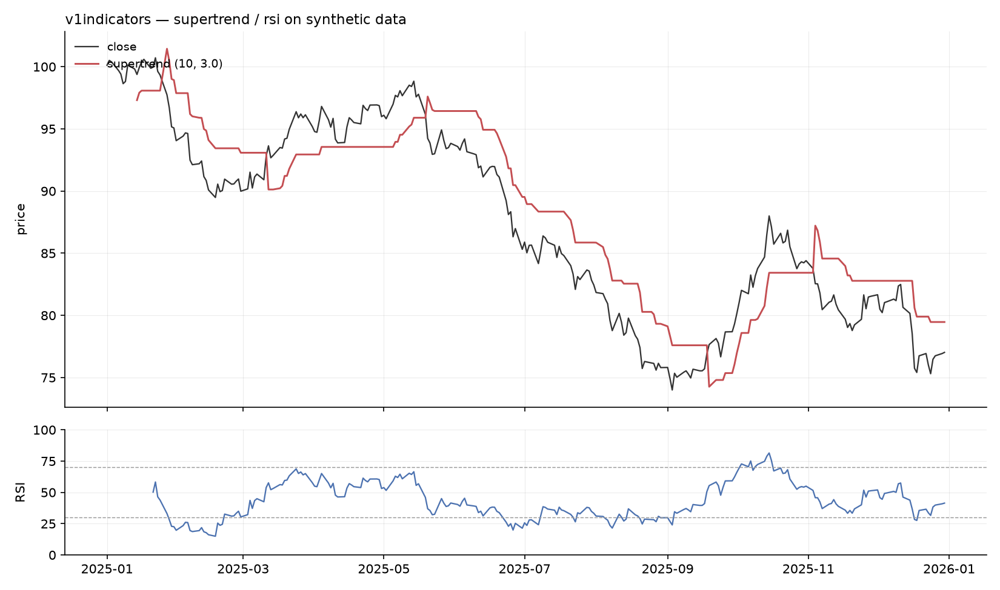

<!-- ======================================================================
     BANNER PLACEHOLDER
     Drop a wide banner image at docs/assets/banner.png and uncomment the
      tag below. Until then the centered title acts as the masthead.
======================================================================= -->

<div align="center">

<!--  -->

# v1indicators

**Technical analysis indicators for Python**

Pandas Series in, pandas Series or DataFrame out — named, typed, and
indexed like the input.

[](https://github.com/Vatthu/v1indicators/actions/workflows/tests.yml)


</div>

---

<div align="center">
  
  <p><sub><code>supertrend(high, low, close, length=10, mult=3.0)</code> and <code>rsi(close, length=14)</code>
  on synthetic data · generated with matplotlib by
  <a href="docs/assets/make_example_chart.py">docs/assets/make_example_chart.py</a></sub></p>
</div>

The scope is deliberate: indicator math only. No charting, no broker
integrations, no strategy execution framework.

## Contents

- [Installation](#installation)
- [Quick start](#quick-start)
- [Correctness guarantees](#correctness-guarantees)
- [What is *not* verified](#what-is-not-verified)
- [Conventions](#conventions)
- [API layout](#api-layout)
- [Development](#development)

## Installation

```bash
pip install .            # from a checkout
pip install -e ".[dev]"  # development install
```

Requires Python 3.10+, numpy, pandas, numba.

## Quick start

```python
import pandas as pd
from v1indicators import rsi, macd, supertrend

df = pd.read_csv("data.csv")

# single output -> named Series
df["RSI_14"] = rsi(df["close"], length=14)

# multiple outputs -> DataFrame with stable column names
macd_df = macd(df["close"], fast=12, slow=26, signal=9)
st_df = supertrend(df["high"], df["low"], df["close"], length=10, mult=3.0)
```

| Output kind | Return type | Example columns |
|---|---|---|
| Single value | `pd.Series` | `RSI_14` |
| Multiple values | `pd.DataFrame` | `MACD`, `MACD_SIGNAL`, `MACD_HIST` |

Every output preserves the input index and length.

## Correctness guarantees

Enforced by tests and CI (Python 3.10 / 3.12 / 3.14). A regression in any
of them fails the build.

| Guarantee | What it means | Enforced by |
|---|---|---|
| No look-ahead bias | Values on the first *K* bars never change when future bars are appended | `test_causality.py` · `test_causality_params.py` |
| Textbook parity | ~30 core indicators match naive reference loops at 1e-9 | `test_parity_core.py` · `test_reference_math.py` |
| NaN warmup | Outputs stay NaN until enough history exists | `test_warmup_contract.py` |
| Calendar correctness | Day/week/month and session levels are right on gapped exchange calendars | `test_calendar_sessions.py` |
| Interoperability | All outputs align on index and length across nine scenarios | `test_interoperability_matrix.py` |

<details>
<summary><strong>No look-ahead bias</strong> — how the suite rules out repainting</summary>

An indicator that changes its past values when future bars arrive repaints,
and any backtest built on it is wrong.

- Every public function is checked on several synthetic datasets.
- The check repeats under non-default parameter values.
- Pivot indicators activate levels only once the pivot is confirmed.
- `ichimoku` emits Chikou as `close - close.shift(kijun)` — same information, no future bars.
- `causal=False` (retrospective plotting mode) repaints by definition and raises a `UserWarning`.
- `dpo` and `vp` were removed: no causal form of either exists.

</details>

<details>
<summary><strong>Textbook parity</strong> — what is compared against reference loops</summary>

Covers the moving-average family, Bollinger Bands, Donchian, MACD,
Stochastic, Williams %R, CMO, Ultimate, Aroon, ADX, PSAR, ATR, Parkinson,
Garman-Klass, Choppiness, OBV, AD, CMF, VWAP and rolling statistics — each
compared against a plain-Python loop written from its textbook formula.

</details>

<details>
<summary><strong>NaN warmup</strong> — how much history each output needs</summary>

Outputs are NaN until enough history exists for the value to mean something.

- `length` observations for a single window or ewm stage.
- Nested chains add up: TEMA needs `3*(length-1)` bars, MACD signal `slow+signal-2`.
- Kernel-based averages (`kama`, `vidya`, `mcgd`, `ssf`, `hwma`, `kalman_filter`) and `psar` seed from the first bars by algorithm definition — feed warmup history.

</details>

## What is *not* verified

> [!WARNING]
> Six indicators compose the primitives above into trading signals. Their
> outputs are causal by construction — that is all this library claims about
> them. Nothing here measures whether their signals predict anything.

| Signal engine | Output |
|---|---|
| `range_filter_confluence` | gated trend signals with a strength score |
| `precision_confluence` | preset-aware confluence entries with SL/TP ladder |
| `dual_score_signals` | dual-score entries with a five-step TP ladder |
| `htf_reversal_divergence` | higher-timeframe reversal patterns with RSI divergence |
| `swing_trend_entry` | moving-average touch entries |
| `swing_leg_profile` | per-swing-leg volume profile |

Validate on your own data before trading any of them.

## Conventions

| Situation | Behavior |
|---|---|
| Unsorted input index | `ValueError` — bar *i+1* must follow bar *i* |
| Boolean flag columns | `False` when inputs are NaN or insufficient |
| Session/calendar tools | Index-local clock, no timezone conversion; "prior day" = prior *trading* day |
| `vwap` | Anchored to the first bar of the input — slice for a session VWAP |
| Short names | `kc` = `keltner`, `squeeze` = `squeeze_momentum`, `uo` = `ultimate_oscillator`, `willr` = `williams_r` |

## API layout

Import from the root:

```python
from v1indicators import ema, sma, rsi, atr, obv
```

or from a family module:

```python
from v1indicators.momentum import rsi, stoch
```

| Family | Symbols | Examples |
|---|---:|---|
| overlap | 43 | `ema`, `sma`, `bbands`, `donchian`, `keltner` |
| momentum | 52 | `rsi`, `macd`, `stochastic`, `williams_r` |
| trend | 38 | `supertrend`, `adx`, `psar`, `aroon` |
| volatility | 13 | `atr`, `parkinson`, `garman_klass`, `chop` |
| volume | 17 | `obv`, `ad`, `cmf`, `vwap`, `pvt` |
| statistics | 11 | `stdev`, `zscore`, `hurst`, `entropy` |
| levels | 4 | `support_resistance`, `pivot_points` |
| performance | 4 | `log_return`, `drawdown` |

A second namespace mirrors how indicators are built:

```python
from v1indicators.foundational.overlap import ema   # direct from price/volume
from v1indicators.derived.trend import supertrend   # built on other indicators
```

Family modules re-export both layers and remain the compatibility surface.

> [!NOTE]
> New work incubates in `experimental/`, which is not shipped to PyPI.

Most indicators take close only; range-based ones take high/low/close;
volume indicators add volume. Series must share an index.

## Development

<details>
<summary><strong>Test commands</strong></summary>

```bash
pytest                                     # full suite (~7 s)
pytest -q tests/test_causality.py          # prefix invariance, all functions
pytest -q tests/test_causality_params.py   # same, non-default parameters
pytest -q tests/test_parity_core.py        # textbook reference parity
pytest -q tests/test_interoperability_matrix.py
```

</details>

> [!IMPORTANT]
> The causality gates discover public functions automatically: a new
> repainting indicator fails the suite without a test being written for it.

See [CHANGELOG.md](CHANGELOG.md) for release history. License: MIT.
